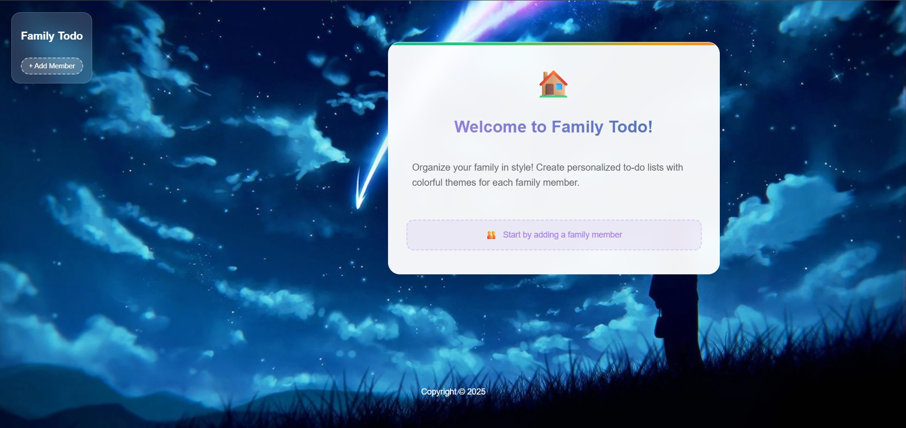

# 👨‍👩‍👧‍👦 Family Todo App

A family task management web application with personalized color themes for each family member.



## ✨ Features

- 🎨 **14 custom color themes** personalized per user
- 👨‍👩‍👧‍👦 **Multi-user support** - Each member has their own list
- ✅ **Full CRUD operations** - Create, read, update, delete tasks
- 📱 **Responsive Design** - Optimized for mobile and tablet
- 🎯 **Intuitive interface** with themed SVG icons
- 🏠 **Personalized welcome** with greeting card
- ✏️ **Inline editing** - Edit tasks directly in the list
- 🎭 **Dynamic theme switching** with real-time updates

## 🛠️ Technologies Used

- **Backend:** Node.js, Express.js
- **Database:** PostgreSQL
- **Frontend:** EJS templating, CSS3 (CSS Variables, Glassmorphism)
- **Icons:** Custom SVG icons (42 themed icons total)
- **Security:** Environment variables (dotenv)
- **Styling:** Modern glassmorphism effects with space background

## 🚀 Installation

### Prerequisites
- Node.js (v18+)
- PostgreSQL
- npm or yarn

### Installation Steps

1. **Clone the repository**
   ```bash
   git clone https://github.com/Laslousa/Todoo.git
   cd Todoo
   ```

2. **Install dependencies**
   ```bash
   npm install
   ```

3. **Set up the database**
   ```bash
   # Create PostgreSQL database
   createdb permalist
   
   # Connect to the database and create tables
   psql -d permalist
   
   # Create the tables (copy and paste these commands in psql)
   CREATE TABLE users (
     user_id SERIAL PRIMARY KEY NOT NULL,
     name VARCHAR(25) NOT NULL UNIQUE,
     color TEXT NOT NULL
   );
   
   CREATE TABLE items (
     item_id SERIAL PRIMARY KEY NOT NULL,
     title VARCHAR(100) NOT NULL ,
     user_id INTEGER REFERENCES users(user_id) ,
     UNIQUE (title,user_id)
   );
   
   # Exit psql
   \q
   ```

4. **Configure environment variables**
   ```bash
   # Copy the example file
   cp .env.example .env
   
   # Edit .env with your settings
   nano .env
   ```

5. **Start the application**
   ```bash
   npm start
   ```

6. **Open in browser**
   ```
   http://localhost:3000
   ```

## ⚙️ Configuration

Create a `.env` file in the root directory with:

```env
DB_USER=your_db_user
DB_HOST=localhost
DB_NAME=permalist
DB_PASSWORD=your_secure_password
DB_PORT=your_db_port
SERVER_PORT=3000
NODE_ENV=development
```

## 🎨 Available Themes

The application offers 14 beautiful color themes:
- **Purple Blue** - Elegant purple gradient
- **Blue** - Classic professional blue
- **Teal** - Modern teal accent
- **Coral** - Warm coral pink
- **Green** - Fresh nature green
- **Orange** - Vibrant sunset orange
- **Red** - Bold cherry red
- **Pink** - Playful magenta
- **Indigo** - Deep indigo purple
- **Cyan** - Cool cyan blue
- **Amber** - Golden amber
- **Brown** - Earthy brown
- **Deep Orange** - Rich burnt orange
- **Lime** - Bright lime green

## 🏗️ Database Schema

```sql
-- Users table
CREATE TABLE users (
  user_id SERIAL PRIMARY KEY NOT NULL,
  name VARCHAR(25) NOT NULL UNIQUE,
  color TEXT NOT NULL
);

-- Items table
CREATE TABLE items (
  item_id SERIAL PRIMARY KEY NOT NULL,
  title VARCHAR(100) NOT NULL ,
  user_id INTEGER REFERENCES users(user_id) ,
  UNIQUE (title,user_id)
);
```

## 📱 Key Features

### Multi-User Management
- Add new family members with personalized themes
- Edit user names and colors
- Delete users 
- Switch between users seamlessly

### Task Management
- Add new tasks
- Edit tasks inline
- Delete completed tasks

### Visual Design
- Space-themed background
- Glassmorphism UI effects
- Color-coordinated icons for each theme
- Responsive grid layout
- Smooth animations and transitions

## 🔒 Security Features

- ✅ Environment variables for credentials
- ✅ Secure database configuration
- ✅ Error handling without information disclosure

## 🎯 Icon System

The app features a complete icon ecosystem with 42 custom SVG icons:
- **14 Pencil icons** (editing) - one for each theme
- **14 Check icons** (completion) - one for each theme  
- **14 Trash icons** (deletion) - one for each theme

All icons maintain consistent Font Awesome styling with theme-specific colors.

## 🤝 Contributing

Contributions are welcome! To contribute:

1. Fork the project
2. Create your feature branch (`git checkout -b feature/new-feature`)
3. Commit your changes (`git commit -m 'Add new feature'`)
4. Push to the branch (`git push origin feature/new-feature`)
5. Open a Pull Request


## 📄 License

This project is licensed under the MIT License. See the `LICENSE` file for details.

## 👨‍💻 Author

**Laslousa**
- GitHub: [@Laslousa](https://github.com/Laslousa)

## 🙏 Acknowledgments

- Font Awesome for icon design inspiration
- PostgreSQL community for excellent documentation
- Express.js team for the robust framework
- The open source community

---

⭐ **If you found this project helpful, please give it a star!**
